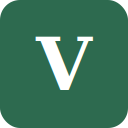

<p align="center">
  
</p>

# **Vokabular**

Learning German online is great, but vocabulary was a mess. Words scattered across notes, others gone forever. Vokabular fixes that: right-click any word on the page, save it instantly, and review everything in one clean dashboard.

A Firefox/Zen browser extension for saving and learning German vocabulary.

## Installation (Zen / Firefox)

1. Clone or download this repository
2. Open `about:debugging#/runtime/this-firefox` in Zen/Firefox
3. Click **Load Temporary Add-on…**
4. Navigate to the project folder and select `manifest.json`

The extension is now active.

## Reloading after code changes

1. Open `about:debugging#/runtime/this-firefox`
2. Find **Vokabular** in the list
3. Click **Reload**

Your changes take effect immediately. No need to remove and re-add the extension.

## Usage

- Select any German word on a webpage, right-click, and choose **Zu Vokabular hinzufügen**
- Open the dashboard via the extension icon to browse your word list, practise with flashcards, or export to CSV/JSON to use in Anki

## Development

```bash
npm install
npm test
```
